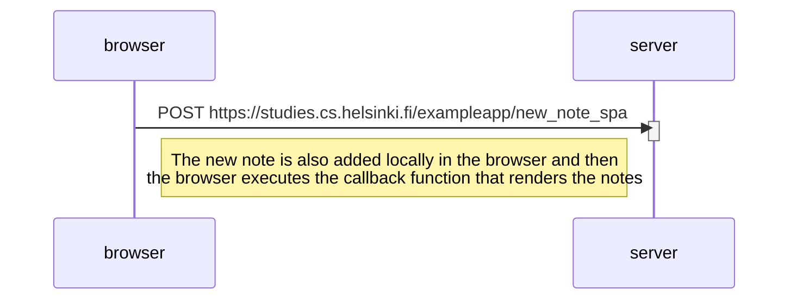

```mermaid
sequenceDiagram
    participant browser
    participant server
    
    browser->>server: POST https://studies.cs.helsinki.fi/exampleapp/new_note_spa
    activate server
    deactivate server

    Note right of browser: The new note is also added locally in the browser and then <br/> the browser executes the callback function that renders the notes
```
